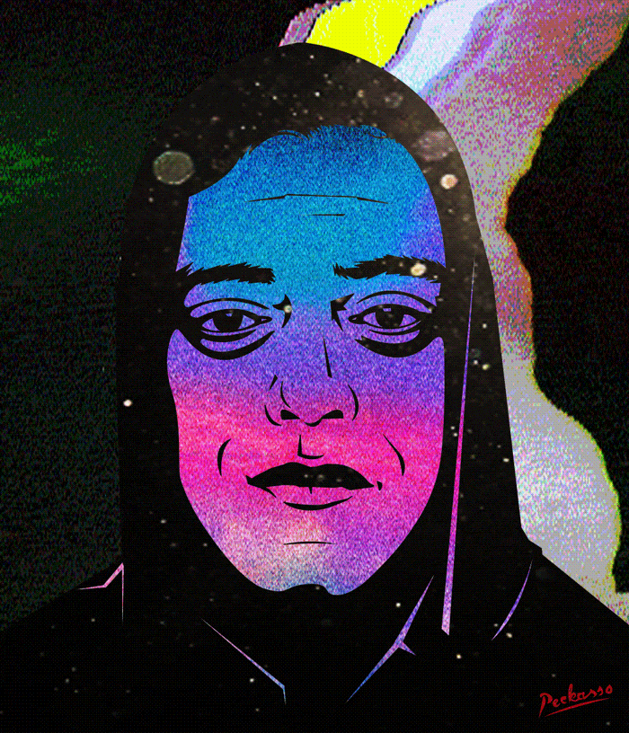

<h2>Hi there 👋! I'm Saroj</h2>

  <i><b>Let's Connect!</b></i>

## About Me

I love developing websites, web apps like to explore new things everyday. I'm passionate about web design, development, Data Structure and Algorithms, and always motivated to learn new skills. I also write gaming and tech blogs which you can find [here](https://onth3loop.blogspot.com).

## Tech Stack

&nbsp;
&nbsp;
&nbsp;
&nbsp;
&nbsp;
&nbsp;
&nbsp;
&nbsp;
&nbsp;
&nbsp;
&nbsp;
&nbsp;
&nbsp;
&nbsp;
&nbsp;

## Pins
<b>#Hacktoberfest2022</b>

<b>Also, Here is a cool-looking Elliot (Mr. Robot) GIF! :)</b>

## GitHub Analytics

<a href="https://github.com/SarojWasti">
  
  
  <!---->
</a>

  
<strong>GitHub Profile Trophies 🏆</strong>

 

